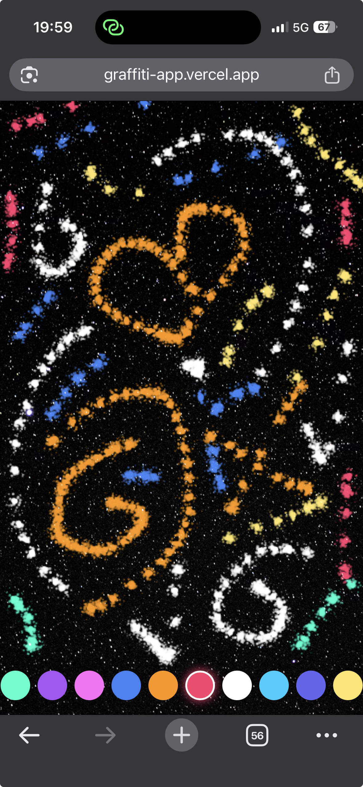

# Cosmic Ink

Paint with light on the cosmos. Cosmic Ink is an interactive canvas experience where you draw glowing particle trails on a deep space background — built as a hands-on reverse engineering study of a graffiti spray paint app.

## Project Overview

Cosmic Ink is a Next.js 14 App Router application built with TypeScript and Tailwind CSS. It features a full HTML5 Canvas drawing engine powered by a Gaussian particle spray algorithm (Box-Muller transform), real-time mouse and touch event handling, a custom floating cursor (a light wand that replaces the system cursor), and a cosmic color palette with a screen blend mode that makes overlapping light beams merge toward white. The app ships with a cinematic entry animation using the Cinzel typeface, a frosted glass settings panel that becomes a slide-up drawer on mobile, iOS safe area handling for iPhone home indicator compatibility, and a horizontal scroll toolbar with CSS snap points for color selection on small screens.

## Knowledge Gained

- Gained an understanding of the HTML5 Canvas 2D API, specifically how drawing is imperative and stateful rather than declarative like React, why `useRef` is the correct escape hatch for direct DOM access, and how `ctx.shadowColor` with `ctx.shadowBlur` produces per-particle glow effects. 

- Learned the Box-Muller transform for generating Gaussian-distributed random numbers from uniform `Math.random()` calls, and how squaring the size falloff ratio produces organic-looking density rather than a mechanical stamp. 

- Built a solid mental model of CSS blend modes, including `multiply` for paint on light surfaces versus `screen` for light on dark surfaces. 

- Developed strong patterns for layered React component architecture using `z-index` stacking, `pointer-events-none` for overlay elements that must not intercept clicks, and the ghost placeholder pattern for keeping toolbar layout stable when the selected item is visually removed. 

- Understood why touch events require `e.preventDefault()` to stop browser scroll interference, why window-level event listeners are needed for cursor tracking rather than element-level ones, and how `env(safe-area-inset-bottom)` with `viewport-fit=cover` solves iOS home indicator overlap. 

- Applied phase-based animation sequencing with `setTimeout` chains for entry animations and toast notifications, and learned the cubic-bezier deceleration curve that makes drawer slide animations feel native.

## The Impact

Rebuilt a production-quality interactive canvas app from scratch through deliberate commit-by-commit reverse engineering of the existing codebase, each commit introducing exactly one concept before moving to the next. 

Starting from a blank Next.js page and arriving at a fully mobile-responsive, touch-enabled, iOS-safe drawing experience with custom cursors, particle physics, and cinematic polish demonstrates how complex frontend applications are composed from small, well-understood primitives. 

The cosmic theme with swapping spray paint for light wands, brick walls for deep space, drips for glow beams, and a floating cursor shows how a complete creative identity can be built on top of borrowed mechanics while the underlying architecture remains the same.

